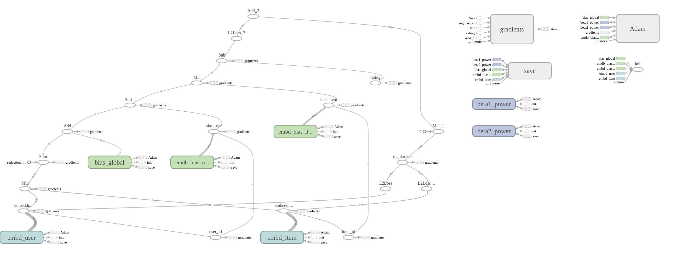

## Tensorflow code for model based recommender systems
This is the Tensorflow implementation of 4 different recommender models.


- Latent factor model recommender system
- Deep neural network based recommender system
- Ensemble of latent factor model and deep neural network model without transfer learning
- Ensemble of latent factor model and deep neural network model with transfer learning


## Dependecies
The prominent packages are:

* numpy
* scikit-learn
* tensorflow 1.5.0
* pandas 0.23.1


### Dataset
- [MovieLens 100K Dataset](https://grouplens.org/datasets/movielens/100k/)
- [MovieLens 1M Dataset](https://grouplens.org/datasets/movielens/1m/)
- [MovieLens 20M Dataset](https://grouplens.org/datasets/movielens/20m/)


### Run
```
mkdir datasets
mkdir tf_logs
mkdir pretrained_models
mkdir tf_logs/ml-100k
mkdir tf_logs/ml-1m
mkdir tf_logs/ml-20m
mkdir pretrained_models/ml-100k
mkdir pretrained_models/ml-1m
mkdir pretrained_models/ml-20m
cd scripts
./download_100.sh 
./download_1m.sh 
./download_20m.sh 
```


 ### Training
 ---
Running training of latent factor model on MovieLens 1M Dataset:


```
python main.py --dataset ml-1m \
               --model latent-factor-model \
               --epoch 40 \
               --batch_size 1000 \
               ---dimension 8 \
               --learning_rate 0.001 \
               --optimizer Adam \
               --dropout_rate 0.5 \
               --regularization_factor 0.05 \
               --max_checkout_without_progress 20
```

Running training of deep neural network model on MovieLens 20M Dataset:


```
python main.py --dataset ml-20m \
               --model deep-neural-network-model \
               --epoch 40 \
               --batch_size 1000 \
               --dimension 8 \
               --learning_rate 0.005 \
               --optimizer Adam \
               --dropout_rate 0.5 \
               --regularization_factor 0.1 \
               --max_checkout_without_progress 20
```              

Running training of ensemble model without transfer learning on MovieLens 20M Dataset:


``` 
python main.py --dataset ml-20m \
               --model ensemble-no-transfer-learning \
               --epoch 40 \
               --batch_size 1000 \
               --dimension 8 \
               --learning_rate 0.0001 \
               --optimizer Adam \
               --dropout_rate 0.5 \
               --regularization_factor 0.1 \
               --max_checkout_without_progress 20
``` 


Running training of ensemble model with transfer learning on MovieLens 20M Dataset:


``` 
python main.py --dataset ml-20m \
               --model ensemble-transfer-learning  \
               --epoch 40 \
               --batch_size 1000 \
               --dimension 8 \
               --learning_rate 0.0001 \
               --optimizer Adam \
               --dropout_rate 0.5 \
               --regularization_factor 0.1 \
               --max_checkout_without_progress 20
``` 
Start tensorboard:

```
tensorboard --logdir tf_logs/ml-100k
tensorboard --logdir tf_logs/ml-1m
tensorboard --logdir tf_logs/ml-20m
```

## Latent factor model

 


## Deep neural network model

 

## Ensemble

 


*RMSE, Precision, Recall and F1-score*
---

 &nbsp; &nbsp;&nbsp;    
 &nbsp; &nbsp;&nbsp;    


*Useful Resources*
---


- [WGAN reddit thread](https://www.reddit.com/r/MachineLearning/comments/5qxoaz/r_170107875_wasserstein_gan/)
- [Blogpost](https://lilianweng.github.io/lil-log/2017/08/20/from-GAN-to-WGAN.html)
- [Deconvolution and checkboard Artifacts](https://distill.pub/2016/deconv-checkerboard/)
- [WGAN-CP paper](https://arxiv.org/pdf/1701.07875.pdf)
- [WGAN-GP paper](https://arxiv.org/pdf/1704.00028.pdf)
- [DCGAN paper](https://arxiv.org/pdf/1511.06434.pdf)
- [Working remotely with PyCharm and SSH](https://medium.com/@erikhallstrm/work-remotely-with-pycharm-tensorflow-and-ssh-c60564be862d)
